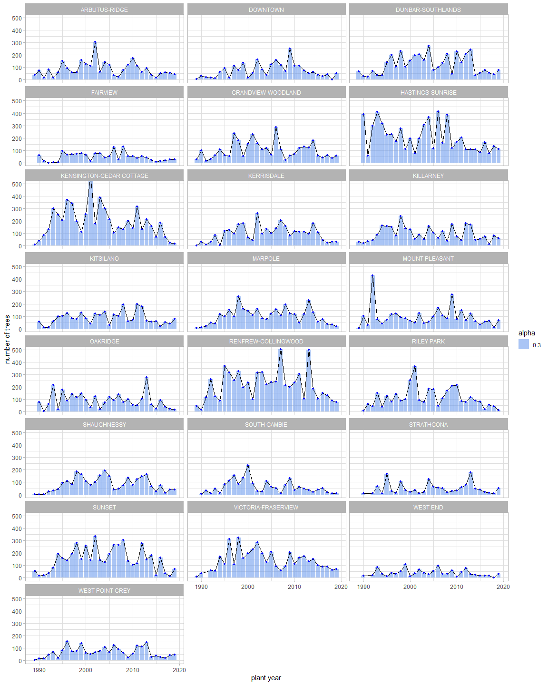
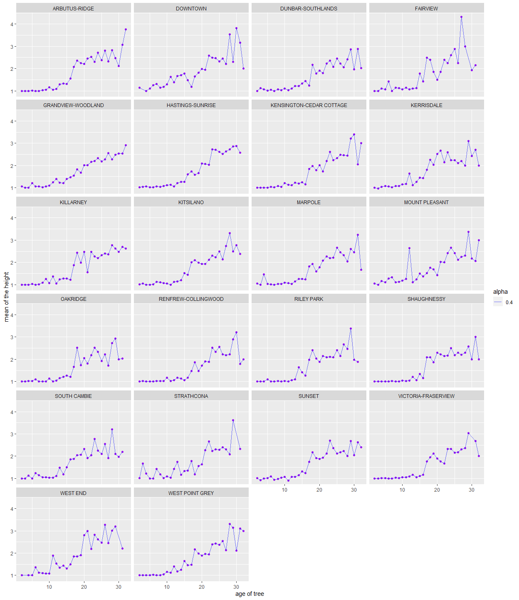
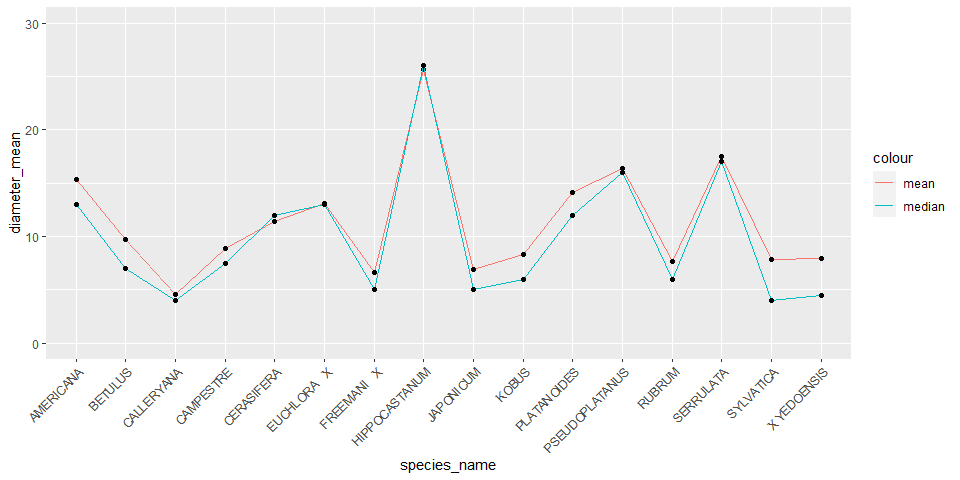
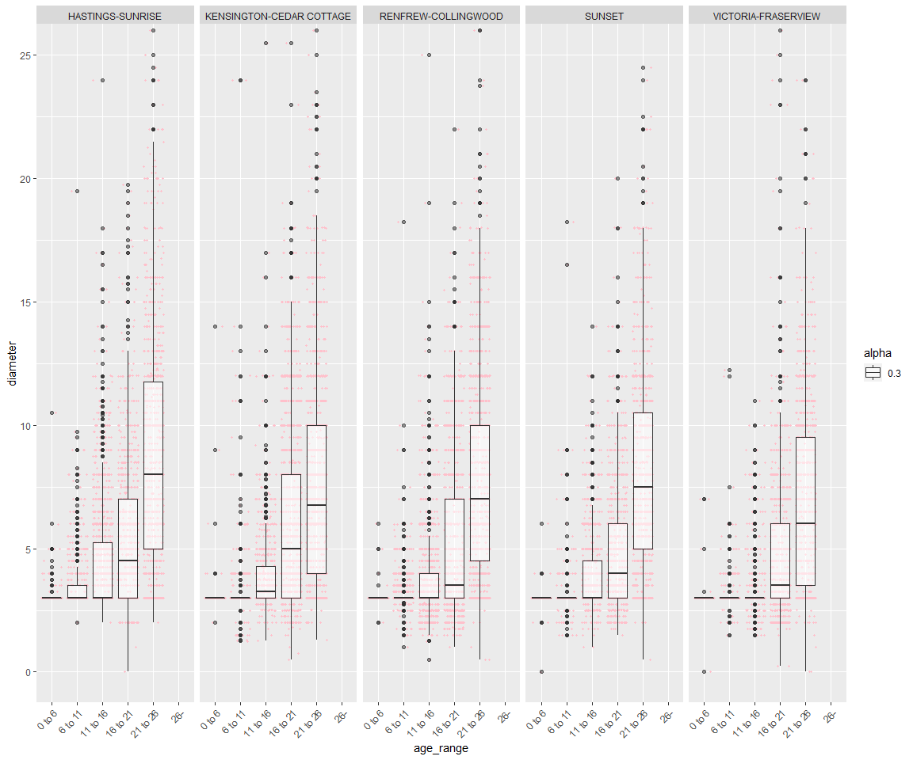

Mini Data Analysis Milestone 2 - vancouver\_trees dataset
================
Yuwei Yang
2021/10/14

Please install the following four packages before running the code. The
package datateachr contains 7 datasets and I will use vancouver\_trees
dataset for this analysis. The package tidyverse contains the package
dplyr and tidyr, and I will use it to do data wrangling and tidy data.
The package ggplot2 is used to do visualization in this analysis. The
package lubridate provides tools to parse and manipulate dates.

``` r
library(datateachr) #contain the dataset we will be using
library(tidyverse) 
library(ggplot2)
library(lubridate)
```

For this Mini Data Analysis 2, I will be using the vancouver\_trees
dataset. This analysis contains two parts: 1. I will summarize and plot
one graph using the vancouver\_trees dataset for each of the four
research questions. 2. Tidy and untidy the dataset(I will reshape the
vancouver\_trees dataset).

# Task 1: Process and summarize the data

### 1.1 Research Questions:

**The following 4 questions are the goal of this analysis:**

1.  *How many trees were planted every year for each neighbourhood?*
2.  *What’s the relationship between the height of the tree and the age
    of the tree for each neighbourhood?*
3.  *Does the diameter of trees different for each species?*
4.  *Does the diameter of trees different in each neighbourhood?*

### 1.2 Summarizing and graphing:

**I will summarize one tibble and plot one graph for each question.**

### First Question: How many trees were planted every year for each neighbourhood?

**Summarizing:**

I am going to create a new tibble with three columns named
tree\_neighbourhood which contain neighbourhood name, year of the tree
planted and the number of trees planted that year by using dplyr verbs.
I will use this tibble later to plot the graph.

``` r
tree_neighbourhood<-vancouver_trees %>%
  group_by(neighbourhood_name, plant_year = year(date_planted)) %>%
  summarise(number_of_trees = n()) %>%
  drop_na()
```

    ## `summarise()` has grouped output by 'neighbourhood_name'. You can override using the `.groups` argument.

``` r
print(tree_neighbourhood)
```

    ## # A tibble: 671 x 3
    ## # Groups:   neighbourhood_name [22]
    ##    neighbourhood_name plant_year number_of_trees
    ##    <chr>                   <dbl>           <int>
    ##  1 ARBUTUS-RIDGE            1989              41
    ##  2 ARBUTUS-RIDGE            1990              76
    ##  3 ARBUTUS-RIDGE            1991              16
    ##  4 ARBUTUS-RIDGE            1992              81
    ##  5 ARBUTUS-RIDGE            1993              18
    ##  6 ARBUTUS-RIDGE            1994              58
    ##  7 ARBUTUS-RIDGE            1995             151
    ##  8 ARBUTUS-RIDGE            1996              95
    ##  9 ARBUTUS-RIDGE            1997              61
    ## 10 ARBUTUS-RIDGE            1998              59
    ## # ... with 661 more rows

**Graphing:**

Now, the tibble is ready to use. I am going to plot the histogram, path
and point of the number of trees respect to the year that the trees were
planted and separate them into each neighbourhood by using dplyr and
ggplot2. Note: I adjust the fill and alpha transparency for the
histogram in order to see the path better. I set the range of number of
trees to 0 and 500 so it is easier to see the relationship.

``` r
tree_neighbourhood %>%
  group_by(neighbourhood_name) %>%
  ggplot(aes(x=plant_year, y= number_of_trees)) +
  geom_histogram(stat="identity", aes(alpha=0.3),fill="cornflowerblue") +
  coord_cartesian(ylim =  c(0,500))+
  geom_path()+geom_point(size=1,color="blue") +
  facet_wrap(~neighbourhood_name,ncol=3)+
  xlab("plant year")+ylab("number of trees")+
  theme_light()
```

    ## Warning: Ignoring unknown parameters: binwidth, bins, pad

<!-- -->

The summarizing part helps to create the tibble for the graphing part,
and the graphs show that the number of trees were planted every year are
quite different in each neighbourhood.

### Second Question: What’s the relationship between the height of the tree and the age of the tree for each neighbourhood?

I want to find the relationship between height of the tree and the age
of the tree. I am going to create a tibble named height\_sub which
contains the name of neighbourhood, age of tree, the
mean/minimum/maximum/median/standard deviation of the height, then I
arranged the tibble by the age of the tree. The height range is between
0-10 for every 10 feet (e.g., 0 = 0-10 ft, 1 = 10-20 ft, 2 = 20-30 ft,
and 10 = 100+ ft). For example, the mean of the height is 1 means the
mean of the height is between 10-20ft. I will use the height\_sub tibble
to plot the graph.

**Summarizing:**

``` r
height_sub<-vancouver_trees %>%
  group_by(neighbourhood_name, age_of_tree = 2021 - year(date_planted)) %>%
  summarise(height_mean=round(mean(height_range_id, na.rm=TRUE), 2),
            height_min=min(height_range_id, na.rm=TRUE), 
            height_max=max(height_range_id, na.rm=TRUE), 
            height_median=median(height_range_id, na.rm=TRUE),
            height_sd=sd(height_range_id, na.rm=TRUE))%>%
  arrange(age_of_tree)
```

    ## `summarise()` has grouped output by 'neighbourhood_name'. You can override using the `.groups` argument.

``` r
print(height_sub)
```

    ## # A tibble: 693 x 7
    ## # Groups:   neighbourhood_name [22]
    ##    neighbourhood_na~ age_of_tree height_mean height_min height_max height_median
    ##    <chr>                   <dbl>       <dbl>      <dbl>      <dbl>         <dbl>
    ##  1 ARBUTUS-RIDGE               2        1             1          1             1
    ##  2 DOWNTOWN                    2        1.15          1          2             1
    ##  3 DUNBAR-SOUTHLANDS           2        1             1          1             1
    ##  4 FAIRVIEW                    2        1             1          1             1
    ##  5 GRANDVIEW-WOODLA~           2        1.05          1          3             1
    ##  6 HASTINGS-SUNRISE            2        1.03          1          2             1
    ##  7 KENSINGTON-CEDAR~           2        1             1          1             1
    ##  8 KERRISDALE                  2        1             1          1             1
    ##  9 KILLARNEY                   2        1             1          1             1
    ## 10 KITSILANO                   2        1.01          0          2             1
    ## # ... with 683 more rows, and 1 more variable: height_sd <dbl>

**Graphing:**

I am going to plot the mean of the height with respect to the age of
tree for each neighbourhood using the geom\_point, geom\_line, and
facet\_wrap.

``` r
height_sub %>%
  group_by(neighbourhood_name) %>%
  drop_na() %>% #drop null columns
  ggplot(aes(x=age_of_tree, y= height_mean)) +
  geom_point(size=1.5, color="purple") + 
  geom_line(aes(alpha=0.4),colour = "blue")+
  facet_wrap(~neighbourhood_name, ncol = 4)+
  ylab("mean of the height") + xlab("age of tree")
```

<!-- -->

The summarizing part creates the tibble for the graphing part, and the
graphs show that as the age of the tree gets larger, the mean of the
height of three tends to get larger. There is a positive relationship
between the height and the age of the tree.

### Third Question: Does the diameter different for each species?

**Summarizing:**

To find out if the diameter is different for each species, I am going to
create a tibble named tree\_diameter which contains species name,
mean/minimum/maximum/median/standard deviation of the diameter for each
species, and the number of trees of each species by using summarise().
Then I arranged the tibble using the mean of diameter. The
tree\_diameter tibble is used for graphing.

``` r
tree_diameter <- vancouver_trees %>%
  select(diameter, species_name) %>%
  group_by(species_name) %>%
  summarise(diameter_mean=mean(diameter, na.rm=TRUE), diameter_min=min(diameter, na.rm=TRUE), diameter_max=max(diameter, na.rm=TRUE), diameter_median=median(diameter, na.rm=TRUE), diameter_sd=sd(diameter, na.rm=TRUE), number_of_trees=n()) %>%
  arrange(across(diameter_mean))
print(tree_diameter)
```

    ## # A tibble: 283 x 7
    ##    species_name  diameter_mean diameter_min diameter_max diameter_median
    ##    <chr>                 <dbl>        <dbl>        <dbl>           <dbl>
    ##  1 OFFICIANALIS           2.78         2            5               3   
    ##  2 LAEVIS                 2.92         1.5          5               2.62
    ##  3 GRANDIFLORA X          2.98         0            4               3   
    ##  4 ARBOREUM               3            1.75         4.25            3   
    ##  5 ARMENIACA              3            3            3               3   
    ##  6 CAPITATA               3            3            3               3   
    ##  7 COCOMILIA              3            3            3               3   
    ##  8 CYLINDRICA             3            3            3               3   
    ##  9 ELLIPSOIDALIS          3            3            3               3   
    ## 10 KOREANA                3            3            3               3   
    ## # ... with 273 more rows, and 2 more variables: diameter_sd <dbl>,
    ## #   number_of_trees <int>

**Graphing:**

I am going to use the tibble above to plot the point and line of mean
and median of the trees with respect to each species. Since there are
283 species, it is impossible to plot all of them. So I decide to plot
only those species that have more than 2000 trees so we have enough
samples to analyze. I also set the range of diameter\_mean to 0 and 30
to make the graph easier to see.

``` r
tree_diameter %>%
  filter(number_of_trees >2000) %>%
  # Filter the species that have more than 2000 trees
  ggplot(aes(species_name)) + 
  geom_line(aes(y = diameter_mean, colour = "mean",group=1)) + 
  geom_point(aes( y = diameter_mean)) +
  #plot the line and point for mean
  geom_line(aes(y = diameter_median, colour = "median", group=1))+
  geom_point(aes( y = diameter_median)) +
  #plot the line and point for median
  coord_cartesian(ylim =  c(0,30))+
  theme(axis.text.x = element_text(angle = 45, vjust = 1, hjust = 1))
```

<!-- -->

The graphing part uses the tibble from summarizing part to analyze the
relationship between the mean/mean of the tree and different species.
From the graph, the mean and median of diameter for each species are
quite different.

### Fourth Question: Does the tree diameter different in each neighbourhood with respect to age of the tree?

**Summarizing:**

For the summarizing part, I am going divide the age of the trees into 5
groups( 0 to 6, 6 to 11, 11 to 16, 16 to 21, 21 to 26, and 26 +) because
I want to plot the boxplot for the diameter for each neightbourhood, and
by dividing them into different age group, it will be easier to compare
the boxplots.

Then, I am going to group the data by neighbourhood name and the 5 age
groups, and then use summarise() to find the
mean/minimum/maximum/median/standard deviation of the diameter for each
neighbourhood and each age group. It is arranged by the age groups, so
it is easier to see if the diameter is different. From the tibble, it is
clear that the mean diameters are different for each age group.
Especially when the age gets larger, this difference becomes larger.

``` r
vancouver_trees %>%
  select(neighbourhood_name, date_planted, diameter) %>%
  drop_na() %>% # drop all the rows that contain NULL
  mutate(age_of_tree = 2021 - year(date_planted)) %>%
  #add the column of age of the tree
  mutate(age_range = case_when(age_of_tree<6 ~ "0 to 6",
                               age_of_tree<11 ~ "6 to 11",
                               age_of_tree<16 ~ "11 to 16",
                               age_of_tree<21 ~ "16 to 21",
                               age_of_tree<26 ~ "21 to 26",
                               TRUE ~ "26+")) %>%
  group_by(neighbourhood_name, age_range) %>%
  summarise( diameter_mean=mean(diameter, na.rm=TRUE), diameter_min=min(diameter, na.rm=TRUE), diameter_max=max(diameter, na.rm=TRUE), diameter_median=median(diameter, na.rm=TRUE), diameter_sd=sd(diameter, na.rm=TRUE), n=n()) %>%
  arrange(across(age_range))
```

    ## `summarise()` has grouped output by 'neighbourhood_name'. You can override using the `.groups` argument.

    ## # A tibble: 132 x 8
    ## # Groups:   neighbourhood_name [22]
    ##    neighbourhood_name       age_range diameter_mean diameter_min diameter_max
    ##    <chr>                    <chr>             <dbl>        <dbl>        <dbl>
    ##  1 ARBUTUS-RIDGE            0 to 6             3.06            2         5.25
    ##  2 DOWNTOWN                 0 to 6             3.25            3        14   
    ##  3 DUNBAR-SOUTHLANDS        0 to 6             3.20            3        24   
    ##  4 FAIRVIEW                 0 to 6             3.14            3        10   
    ##  5 GRANDVIEW-WOODLAND       0 to 6             3.10            3         7.5 
    ##  6 HASTINGS-SUNRISE         0 to 6             3.07            3        10.5 
    ##  7 KENSINGTON-CEDAR COTTAGE 0 to 6             3.07            2        14   
    ##  8 KERRISDALE               0 to 6             3.04            0        10.5 
    ##  9 KILLARNEY                0 to 6             3.09            3        22.5 
    ## 10 KITSILANO                0 to 6             3.16            0        18   
    ## # ... with 122 more rows, and 3 more variables: diameter_median <dbl>,
    ## #   diameter_sd <dbl>, n <int>

**Graphing:**

For the graph, I am going divide the age of the trees into 5 groups( 0
to 6, 6 to 11, 11 to 16, 16 to 21, 21 to 26, and 26 +), and use filter
to select neighbourhood that have more than 4000 trees because we can
see from above tibble, there are a lot of neighbourhood and it is hard
to plot all of them. I am going to plot the boxplot and jitterplot of
the diameter for each age group in each neighbourhood.

``` r
vancouver_trees %>%
  select(neighbourhood_name, date_planted, diameter) %>%
  drop_na() %>% # drop all the rows that contain NULL
  mutate(age_of_tree = 2021 - year(date_planted)) %>%
  #add the column of age of the tree
  mutate(age_range = case_when(age_of_tree<6 ~ "0 to 6",
                               age_of_tree<11 ~ "6 to 11",
                               age_of_tree<16 ~ "11 to 16",
                               age_of_tree<21 ~ "16 to 21",
                               age_of_tree<26 ~ "21 to 26",
                               TRUE ~ "26+")) %>%
  #assign the tree into each age group
  group_by(neighbourhood_name) %>%
  filter(n() > 4000 ) %>%
  # Filter the neighbourhood that have more than 2000 trees
  ggplot(aes(x=age_range,y= diameter))+
  scale_x_discrete(limits = c("0 to 6","6 to 11", "11 to 16","16 to 21", "21 to 26", "26-")) +
  geom_jitter(size=0.7, colour = "pink") +
  geom_boxplot(aes(alpha = 0.3)) +
  facet_grid(~neighbourhood_name) +  
  coord_cartesian(ylim =  c(0, 25))+
  theme(axis.text.x = element_text(angle = 45, vjust = 1, hjust = 1))
```

    ## Warning: Removed 4722 rows containing missing values (stat_boxplot).

    ## Warning: Removed 4722 rows containing missing values (geom_point).

<!-- -->

Both the summarizing and graphing parts show that the diameters are
different in each neighboughood for age greater than 11.

### 1.3

The following are my analysis for each questions:

1.  *How many trees were planted per neighborhood every year?*

The number of trees was planted per neighborhood is quite different
every year. And it does not have a clear pattern of how they decide how
many trees they are going to plant. I want to analyze this question
further in more detail. I decided to pick the Kerrisdale neibourhood to
analyze how many trees were planted every year/season/month.

2.  *What’s the relationship between the height of the tree and the age
    of the tree for each neighbourhood?*

The graph shows a positive relationship between the mean height and the
age of the tree in each neighbourhood.

3.  *Does the diameter of trees different for each species?*

The mean and median of the diameter for each species are quite
different. I decide to pick the AMERICANO species to analyze the
relationship of diameter and the age of the tree for this specific
species.

4.  *Does the diameter of trees different in each neighbourhood*

The result is yes. As the age becomes larger, the diameter tends to have
a bigger difference.

# Task 2: Tidy the data

The definition of *tidy* data:

-   Each row is an **observation**
-   Each column is a **variable**
-   Each cell is a **value**

*Tidy’ing* data is sometimes necessary because it can simplify
computation. Other times it can be nice to organize data so that it can
be easier to understand when read manually.

### 2.1 Tidy or Untidy?

I selected the following 8 columns and store them in to the tibble named
vancouver\_trees\_sub. I will use this tibble for later tasks.

``` r
vancouver_trees_sub <- vancouver_trees %>%
  select(genus_name,species_name,cultivar_name,common_name,neighbourhood_name,height_range_id, diameter,date_planted)
print(vancouver_trees_sub)
```

    ## # A tibble: 146,611 x 8
    ##    genus_name species_name cultivar_name   common_name           neighbourhood_n~
    ##    <chr>      <chr>        <chr>           <chr>                 <chr>           
    ##  1 ULMUS      AMERICANA    BRANDON         BRANDON ELM           MARPOLE         
    ##  2 ZELKOVA    SERRATA      <NA>            JAPANESE ZELKOVA      MARPOLE         
    ##  3 STYRAX     JAPONICA     <NA>            JAPANESE SNOWBELL     KENSINGTON-CEDA~
    ##  4 FRAXINUS   AMERICANA    AUTUMN APPLAUSE AUTUMN APPLAUSE ASH   KENSINGTON-CEDA~
    ##  5 ACER       CAMPESTRE    <NA>            HEDGE MAPLE           KENSINGTON-CEDA~
    ##  6 PYRUS      CALLERYANA   CHANTICLEER     CHANTICLEER PEAR      MARPOLE         
    ##  7 ACER       PLATANOIDES  COLUMNARE       COLUMNAR NORWAY MAPLE KENSINGTON-CEDA~
    ##  8 ACER       PLATANOIDES  COLUMNARE       COLUMNAR NORWAY MAPLE KENSINGTON-CEDA~
    ##  9 ACER       PLATANOIDES  COLUMNARE       COLUMNAR NORWAY MAPLE KENSINGTON-CEDA~
    ## 10 FRAXINUS   AMERICANA    AUTUMN APPLAUSE AUTUMN APPLAUSE ASH   KENSINGTON-CEDA~
    ## # ... with 146,601 more rows, and 3 more variables: height_range_id <dbl>,
    ## #   diameter <dbl>, date_planted <date>

genus\_name: This column contains the different genus name of each tree.

species\_name: This column contains the different species name of each
tree.

cultivar\_name: This column contains the cultivar name of each tree.

common\_name: This column contains the common name of each tree.

neighbourhood\_name: This column contains the name of neighbourhood
where the tree is located.

height\_range\_id: The height range is is between 0-10 for every 10 feet
(e.g., 0 = 0-10 ft, 1 = 10-20 ft, 2 = 20-30 ft, and 10 = 100+ ft).

diameter: The diameter of the tree in inches.

date\_planted: The date of planting in YYYYMMDD format.

**This tibble is tidy. Each row in the tibble is a unique observation
and each column is a distinct variable. Each cell is a value respect to
each variable. For my research questions, I am able to use the tibble
directly without tidy the data.**

### 2.2 Tidy and Untidy exercise

Since the data is tidy. I am going to untidy the data first. Then I will
tidy it back to the original tibble.

**Untidy:**

I am going to untidy it by using the pivot\_longer() to combine the
columns(genus\_name, species\_name,cultivar\_name, common\_name)
together. This is untidy because for my research question, I am
analyzing the relationship of diameter with respect to species. If these
columns are combined, I will need to use pivot\_wider to tidy it first
to do the analysis.

``` r
vancouver_trees_sub1 <- vancouver_trees_sub %>%
  pivot_longer(cols = c("genus_name":"common_name"), 
              names_to = "name_class", values_to = "name_of_tree")
print(vancouver_trees_sub1)
```

    ## # A tibble: 586,444 x 6
    ##    neighbourhood_name       height_range_id diameter date_planted name_class   
    ##    <chr>                              <dbl>    <dbl> <date>       <chr>        
    ##  1 MARPOLE                                2       10 1999-01-13   genus_name   
    ##  2 MARPOLE                                2       10 1999-01-13   species_name 
    ##  3 MARPOLE                                2       10 1999-01-13   cultivar_name
    ##  4 MARPOLE                                2       10 1999-01-13   common_name  
    ##  5 MARPOLE                                4       10 1996-05-31   genus_name   
    ##  6 MARPOLE                                4       10 1996-05-31   species_name 
    ##  7 MARPOLE                                4       10 1996-05-31   cultivar_name
    ##  8 MARPOLE                                4       10 1996-05-31   common_name  
    ##  9 KENSINGTON-CEDAR COTTAGE               3        4 1993-11-22   genus_name   
    ## 10 KENSINGTON-CEDAR COTTAGE               3        4 1993-11-22   species_name 
    ## # ... with 586,434 more rows, and 1 more variable: name_of_tree <chr>

**Tidy:**

The columns(genus\_name, species\_name,cultivar\_name, common\_name) are
combined into two columns(name\_class and name\_of\_tree). This data is
untidy right now, so I am going to use pivot\_wider to make it tidy
again.

``` r
vancouver_trees_sub2 <- vancouver_trees_sub1 %>%
  pivot_wider( names_from = name_class,
                values_from = name_of_tree) %>%
  unnest()
```

    ## Warning: Values are not uniquely identified; output will contain list-cols.
    ## * Use `values_fn = list` to suppress this warning.
    ## * Use `values_fn = length` to identify where the duplicates arise
    ## * Use `values_fn = {summary_fun}` to summarise duplicates

    ## Warning: `cols` is now required when using unnest().
    ## Please use `cols = c(genus_name, species_name, cultivar_name, common_name)`

``` r
print(vancouver_trees_sub2)
```

    ## # A tibble: 146,611 x 8
    ##    neighbourhood_name       height_range_id diameter date_planted genus_name
    ##    <chr>                              <dbl>    <dbl> <date>       <chr>     
    ##  1 MARPOLE                                2       10 1999-01-13   ULMUS     
    ##  2 MARPOLE                                2       10 1999-01-13   ULMUS     
    ##  3 MARPOLE                                4       10 1996-05-31   ZELKOVA   
    ##  4 KENSINGTON-CEDAR COTTAGE               3        4 1993-11-22   STYRAX    
    ##  5 KENSINGTON-CEDAR COTTAGE               4       18 1996-04-29   FRAXINUS  
    ##  6 KENSINGTON-CEDAR COTTAGE               2        9 1993-12-17   ACER      
    ##  7 MARPOLE                                2        5 NA           PYRUS     
    ##  8 MARPOLE                                2        5 NA           CARPINUS  
    ##  9 MARPOLE                                2        5 NA           PRUNUS    
    ## 10 MARPOLE                                2        5 NA           RHUS      
    ## # ... with 146,601 more rows, and 3 more variables: species_name <chr>,
    ## #   cultivar_name <chr>, common_name <chr>

### 2.3

I want to analyze the following two questions in milestone 3:

I modified my questions to be more specific from the original questions
which are too broad. So I pick one specific species and one specific
neighbourhood to analyze.

1.  What’s relationship of diameter with respect to age of the tree for
    AMERICANO species.

2.  How many trees were planted every year in Kerrisdale neighbourhood?
    How about every season? Every month?

Next, I am going to modify the data to make it more appropriate to
answer the above questions in milestone 3. To answer the 2 questions, I
will select the following columns: species\_name, diameter,
date\_planted, neighbourhood\_name. Then I am going to filter the rows
that either the species is AMERICANA or the neighbourhood\_name is
KERRISDALE. Also, I am going to add three columns which are the age of
the tree in years, month and the season that the tree was planted. Since
I will no longer need the column of date\_planted, I will drop this
column at the end.

``` r
vancouver_trees %>%
  select(species_name,  diameter, date_planted, neighbourhood_name) %>%
  filter(species_name == "AMERICANA" | neighbourhood_name == "KERRISDALE") %>%
  drop_na() %>%
  mutate(age_of_tree = round(as.numeric((ymd(20211004) - ymd(date_planted))/365),digits=2)) %>%
  mutate(plant_month = month(date_planted)) %>%
  mutate(plant_season = case_when(plant_month < 3 ~ "Winter",
                                  plant_month < 6 ~ "Spring",
                                  plant_month < 9 ~ "Summer",
                                  plant_month < 12 ~ "Fall",
                                  TRUE ~ "Winter")) %>%
  select(-date_planted)
```

    ## # A tibble: 5,204 x 6
    ##    species_name diameter neighbourhood_name age_of_tree plant_month plant_season
    ##    <chr>           <dbl> <chr>                    <dbl>       <dbl> <chr>       
    ##  1 AMERICANA       10    MARPOLE                   22.7           1 Winter      
    ##  2 AMERICANA       18    KENSINGTON-CEDAR ~        25.4           4 Spring      
    ##  3 AMERICANA        7.5  KENSINGTON-CEDAR ~        27.8          12 Winter      
    ##  4 AMERICANA       14.5  KITSILANO                 21.7           1 Winter      
    ##  5 KOUSA            3    KERRISDALE                24.7           1 Winter      
    ##  6 AMERICANA       12    KENSINGTON-CEDAR ~        26.6           3 Spring      
    ##  7 AMERICANA       13    KENSINGTON-CEDAR ~        27.4           4 Spring      
    ##  8 TRUNCATUM        3    KERRISDALE                24.8           1 Winter      
    ##  9 AMERICANA        9    RILEY PARK                25.7           2 Winter      
    ## 10 AMERICANA        3.25 RILEY PARK                25.7           2 Winter      
    ## # ... with 5,194 more rows
