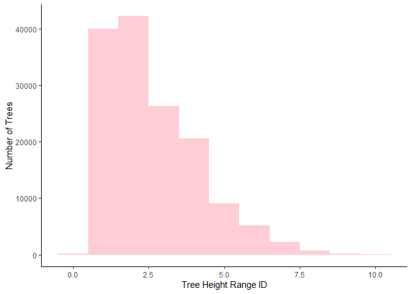
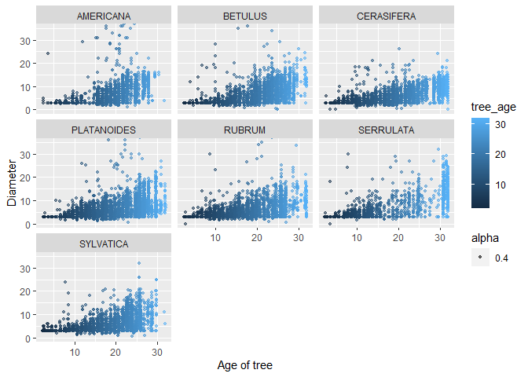

Mini data analysis
================
Yuwei
2021/10/5

Please install the following packages before running the code.

``` r
library(datateachr)
library(tidyverse)
library(ggplot2)
```

# Task 1: Choose datasets

## 1.1 Choose four datasets from datateachr packages:

1: steam\_games: Acquired courtesy of Kaggle. It currently has 40833
rows and 21 columns.

2: flow\_sample: Acquired courtesy of The Government of Canada’s
Historical Hydrometric Database. It currently has 218 rows and 7
columns.

3: parking\_meters: Acquired courtesy of The City of Vancouver’s Open
Data Portal. It currently has 10032 rows and 22 columns.

4: cancer\_sample: Acquired courtesy of UCI Machine Learning Repository.
It currently has 569 rows and 32 columns.

## 1.2 Explore datasets:

This part, I will check the class of the data using class(), the number
of rows and column and the name of each columns with some useful
information using glimse().

This is the information for steam\_games data:

``` r
class(steam_games)
```

    ## [1] "spec_tbl_df" "tbl_df"      "tbl"         "data.frame"

``` r
glimpse(steam_games)
```

    ## Rows: 40,833
    ## Columns: 21
    ## $ id                       <dbl> 1, 2, 3, 4, 5, 6, 7, 8, 9, 10, 11, 12, 13, 14~
    ## $ url                      <chr> "https://store.steampowered.com/app/379720/DO~
    ## $ types                    <chr> "app", "app", "app", "app", "app", "bundle", ~
    ## $ name                     <chr> "DOOM", "PLAYERUNKNOWN'S BATTLEGROUNDS", "BAT~
    ## $ desc_snippet             <chr> "Now includes all three premium DLC packs (Un~
    ## $ recent_reviews           <chr> "Very Positive,(554),- 89% of the 554 user re~
    ## $ all_reviews              <chr> "Very Positive,(42,550),- 92% of the 42,550 u~
    ## $ release_date             <chr> "May 12, 2016", "Dec 21, 2017", "Apr 24, 2018~
    ## $ developer                <chr> "id Software", "PUBG Corporation", "Harebrain~
    ## $ publisher                <chr> "Bethesda Softworks,Bethesda Softworks", "PUB~
    ## $ popular_tags             <chr> "FPS,Gore,Action,Demons,Shooter,First-Person,~
    ## $ game_details             <chr> "Single-player,Multi-player,Co-op,Steam Achie~
    ## $ languages                <chr> "English,French,Italian,German,Spanish - Spai~
    ## $ achievements             <dbl> 54, 37, 128, NA, NA, NA, 51, 55, 34, 43, 72, ~
    ## $ genre                    <chr> "Action", "Action,Adventure,Massively Multipl~
    ## $ game_description         <chr> "About This Game Developed by id software, th~
    ## $ mature_content           <chr> NA, "Mature Content Description  The develope~
    ## $ minimum_requirements     <chr> "Minimum:,OS:,Windows 7/8.1/10 (64-bit versio~
    ## $ recommended_requirements <chr> "Recommended:,OS:,Windows 7/8.1/10 (64-bit ve~
    ## $ original_price           <dbl> 19.99, 29.99, 39.99, 44.99, 0.00, NA, 59.99, ~
    ## $ discount_price           <dbl> 14.99, NA, NA, NA, NA, 35.18, 70.42, 17.58, N~

This is the information for flow\_sample data:

``` r
class(flow_sample)
```

    ## [1] "tbl_df"     "tbl"        "data.frame"

``` r
glimpse(flow_sample)
```

    ## Rows: 218
    ## Columns: 7
    ## $ station_id   <chr> "05BB001", "05BB001", "05BB001", "05BB001", "05BB001", "0~
    ## $ year         <dbl> 1909, 1910, 1911, 1912, 1913, 1914, 1915, 1916, 1917, 191~
    ## $ extreme_type <chr> "maximum", "maximum", "maximum", "maximum", "maximum", "m~
    ## $ month        <dbl> 7, 6, 6, 8, 6, 6, 6, 6, 6, 6, 6, 7, 6, 6, 6, 7, 5, 7, 6, ~
    ## $ day          <dbl> 7, 12, 14, 25, 11, 18, 27, 20, 17, 15, 22, 3, 9, 5, 14, 5~
    ## $ flow         <dbl> 314, 230, 264, 174, 232, 214, 236, 309, 174, 345, 185, 24~
    ## $ sym          <chr> NA, NA, NA, NA, NA, NA, NA, NA, NA, NA, NA, NA, NA, NA, N~

This is the information for vancouver\_trees data:

``` r
class(vancouver_trees)
```

    ## [1] "tbl_df"     "tbl"        "data.frame"

``` r
glimpse(vancouver_trees)
```

    ## Rows: 146,611
    ## Columns: 20
    ## $ tree_id            <dbl> 149556, 149563, 149579, 149590, 149604, 149616, 149~
    ## $ civic_number       <dbl> 494, 450, 4994, 858, 5032, 585, 4909, 4925, 4969, 7~
    ## $ std_street         <chr> "W 58TH AV", "W 58TH AV", "WINDSOR ST", "E 39TH AV"~
    ## $ genus_name         <chr> "ULMUS", "ZELKOVA", "STYRAX", "FRAXINUS", "ACER", "~
    ## $ species_name       <chr> "AMERICANA", "SERRATA", "JAPONICA", "AMERICANA", "C~
    ## $ cultivar_name      <chr> "BRANDON", NA, NA, "AUTUMN APPLAUSE", NA, "CHANTICL~
    ## $ common_name        <chr> "BRANDON ELM", "JAPANESE ZELKOVA", "JAPANESE SNOWBE~
    ## $ assigned           <chr> "N", "N", "N", "Y", "N", "N", "N", "N", "N", "N", "~
    ## $ root_barrier       <chr> "N", "N", "N", "N", "N", "N", "N", "N", "N", "N", "~
    ## $ plant_area         <chr> "N", "N", "4", "4", "4", "B", "6", "6", "3", "3", "~
    ## $ on_street_block    <dbl> 400, 400, 4900, 800, 5000, 500, 4900, 4900, 4900, 7~
    ## $ on_street          <chr> "W 58TH AV", "W 58TH AV", "WINDSOR ST", "E 39TH AV"~
    ## $ neighbourhood_name <chr> "MARPOLE", "MARPOLE", "KENSINGTON-CEDAR COTTAGE", "~
    ## $ street_side_name   <chr> "EVEN", "EVEN", "EVEN", "EVEN", "EVEN", "ODD", "ODD~
    ## $ height_range_id    <dbl> 2, 4, 3, 4, 2, 2, 3, 3, 2, 2, 2, 5, 3, 2, 2, 2, 2, ~
    ## $ diameter           <dbl> 10.00, 10.00, 4.00, 18.00, 9.00, 5.00, 15.00, 14.00~
    ## $ curb               <chr> "N", "N", "Y", "Y", "Y", "Y", "Y", "Y", "Y", "Y", "~
    ## $ date_planted       <date> 1999-01-13, 1996-05-31, 1993-11-22, 1996-04-29, 19~
    ## $ longitude          <dbl> -123.1161, -123.1147, -123.0846, -123.0870, -123.08~
    ## $ latitude           <dbl> 49.21776, 49.21776, 49.23938, 49.23469, 49.23894, 4~

This is the information for cancer\_sample data:

``` r
class(cancer_sample)
```

    ## [1] "spec_tbl_df" "tbl_df"      "tbl"         "data.frame"

``` r
glimpse(cancer_sample)
```

    ## Rows: 569
    ## Columns: 32
    ## $ ID                      <dbl> 842302, 842517, 84300903, 84348301, 84358402, ~
    ## $ diagnosis               <chr> "M", "M", "M", "M", "M", "M", "M", "M", "M", "~
    ## $ radius_mean             <dbl> 17.990, 20.570, 19.690, 11.420, 20.290, 12.450~
    ## $ texture_mean            <dbl> 10.38, 17.77, 21.25, 20.38, 14.34, 15.70, 19.9~
    ## $ perimeter_mean          <dbl> 122.80, 132.90, 130.00, 77.58, 135.10, 82.57, ~
    ## $ area_mean               <dbl> 1001.0, 1326.0, 1203.0, 386.1, 1297.0, 477.1, ~
    ## $ smoothness_mean         <dbl> 0.11840, 0.08474, 0.10960, 0.14250, 0.10030, 0~
    ## $ compactness_mean        <dbl> 0.27760, 0.07864, 0.15990, 0.28390, 0.13280, 0~
    ## $ concavity_mean          <dbl> 0.30010, 0.08690, 0.19740, 0.24140, 0.19800, 0~
    ## $ concave_points_mean     <dbl> 0.14710, 0.07017, 0.12790, 0.10520, 0.10430, 0~
    ## $ symmetry_mean           <dbl> 0.2419, 0.1812, 0.2069, 0.2597, 0.1809, 0.2087~
    ## $ fractal_dimension_mean  <dbl> 0.07871, 0.05667, 0.05999, 0.09744, 0.05883, 0~
    ## $ radius_se               <dbl> 1.0950, 0.5435, 0.7456, 0.4956, 0.7572, 0.3345~
    ## $ texture_se              <dbl> 0.9053, 0.7339, 0.7869, 1.1560, 0.7813, 0.8902~
    ## $ perimeter_se            <dbl> 8.589, 3.398, 4.585, 3.445, 5.438, 2.217, 3.18~
    ## $ area_se                 <dbl> 153.40, 74.08, 94.03, 27.23, 94.44, 27.19, 53.~
    ## $ smoothness_se           <dbl> 0.006399, 0.005225, 0.006150, 0.009110, 0.0114~
    ## $ compactness_se          <dbl> 0.049040, 0.013080, 0.040060, 0.074580, 0.0246~
    ## $ concavity_se            <dbl> 0.05373, 0.01860, 0.03832, 0.05661, 0.05688, 0~
    ## $ concave_points_se       <dbl> 0.015870, 0.013400, 0.020580, 0.018670, 0.0188~
    ## $ symmetry_se             <dbl> 0.03003, 0.01389, 0.02250, 0.05963, 0.01756, 0~
    ## $ fractal_dimension_se    <dbl> 0.006193, 0.003532, 0.004571, 0.009208, 0.0051~
    ## $ radius_worst            <dbl> 25.38, 24.99, 23.57, 14.91, 22.54, 15.47, 22.8~
    ## $ texture_worst           <dbl> 17.33, 23.41, 25.53, 26.50, 16.67, 23.75, 27.6~
    ## $ perimeter_worst         <dbl> 184.60, 158.80, 152.50, 98.87, 152.20, 103.40,~
    ## $ area_worst              <dbl> 2019.0, 1956.0, 1709.0, 567.7, 1575.0, 741.6, ~
    ## $ smoothness_worst        <dbl> 0.1622, 0.1238, 0.1444, 0.2098, 0.1374, 0.1791~
    ## $ compactness_worst       <dbl> 0.6656, 0.1866, 0.4245, 0.8663, 0.2050, 0.5249~
    ## $ concavity_worst         <dbl> 0.71190, 0.24160, 0.45040, 0.68690, 0.40000, 0~
    ## $ concave_points_worst    <dbl> 0.26540, 0.18600, 0.24300, 0.25750, 0.16250, 0~
    ## $ symmetry_worst          <dbl> 0.4601, 0.2750, 0.3613, 0.6638, 0.2364, 0.3985~
    ## $ fractal_dimension_worst <dbl> 0.11890, 0.08902, 0.08758, 0.17300, 0.07678, 0~

# 1.3 Select dataset:

The reasons for choosing these two datasets are quite different. I
choose cancer\_sample because the dataset contains a lot of variables
and they are numeric values, so I think it will be interesting to
analysis the relationship between these data and plot some useful
graphs. And I choose steam\_games because I have been using steam for
few years so I am very interested in analyzing the data from steam
games.

steam\_games: 1. Which developer and publisher receive the most
achievements? 2. Does achievements of the game relate to the
reviews(both recent and all reviews)?

flow\_sample: 1. What the relationship of the flow rate respect with
year? 2. What’s the most busiest day every week?

Vancouver\_trees: 1. For each species, will the height be very
different? (use jitter plot/side by side boxplot) 2. Will the root
barrier affect the diameter of the tree within each species? 3. Does the
plant area relate to the height of the tree? 4. For each neighborhood,
how many trees were planted?

Cancer\_sample: For different diagnosis, will the parameters be
different?

I decide to choose vancouver\_trees to analysis because the variable
seem to have better relationship between them.

\#2.1 1. Plot the distribution of the number of trees using different
height range id. (0-10 for every 10 feet (e.g., 0 = 0-10 ft, 1 = 10-20
ft, 2 = 20-30 ft, and 10 = 100+ ft))

``` r
ggplot(vancouver_trees, aes(height_range_id)) +
  geom_histogram(binwidth=1, fill ="pink", alpha=0.8)+
  xlab("Tree Height Range ID")+ylab("Number of Trees")+
  theme_light()
```

<!-- -->
2. Add a new variable named tree\_age which is the number of years
between the trees were planted and the current year 2021. I want to use
this later to find the relationship between the age of the tree and the
height of the tree.

``` r
age_and_height <- vancouver_trees %>%
  # Calling difftime() function
  mutate(tree_age = round(as.numeric(difftime("2021-10-01", date_planted, units="days"))/365,4)) %>%
  select(species_name,diameter, tree_age, root_barrier)

print(age_and_height)
```

    ## # A tibble: 146,611 x 4
    ##    species_name diameter tree_age root_barrier
    ##    <chr>           <dbl>    <dbl> <chr>       
    ##  1 AMERICANA        10       22.7 N           
    ##  2 SERRATA          10       25.4 N           
    ##  3 JAPONICA          4       27.9 N           
    ##  4 AMERICANA        18       25.4 N           
    ##  5 CAMPESTRE         9       27.8 N           
    ##  6 CALLERYANA        5       NA   N           
    ##  7 PLATANOIDES      15       27.8 N           
    ##  8 PLATANOIDES      14       27.8 N           
    ##  9 PLATANOIDES      16       27.8 N           
    ## 10 AMERICANA         7.5     27.8 N           
    ## # ... with 146,601 more rows

3.  Next, we are going to find out if there is a relationship between
    the age of the tree and the diameter of the tree and what is the
    relationship using geom\_jitter.

``` r
ggplot(age_and_height, aes(tree_age, diameter))+
  geom_jitter(outlier.shape = NA, aes(alpha=0.6, colour=tree_age))+
  coord_cartesian(ylim =  c(0, 50))
```

    ## Warning: Ignoring unknown parameters: outlier.shape

    ## Warning: Removed 76548 rows containing missing values (geom_point).

<!-- -->

4.  As we can see, from the previous part, it seems that the age of the
    tree has a positive relationship with it’s diameter. Next, we are
    going to analysis this in details by separating the trees into
    different species and look at the relationship within each species.

``` r
age_and_height %>%
  group_by(species_name) %>%
  filter(n() >5000) %>%
  ggplot(aes(tree_age, diameter))+ 
  geom_point()+  facet_wrap(~species_name)+
  coord_cartesian(ylim =  c(0, 25))
```

    ## Warning: Removed 36570 rows containing missing values (geom_point).

<!-- -->
5. Last thing I can think about is the root barrier might affect the
trees’ diameter.

``` r
age_and_height %>%
  filter(root_barrier == 'Y') %>%
  group_by(species_name)%>%
  filter(n()>500) %>%
  ggplot(aes(tree_age, diameter))+ 
  geom_point()+  facet_wrap(~species_name)+
  coord_cartesian(ylim =  c(0, 25))
```

    ## Warning: Removed 31 rows containing missing values (geom_point).

<!-- -->

# 3: The following four questions are the goal of this analysis:

1.  For each species, will the height be very different? (use jitter
    plot/side by side boxplot) 2. Will the root barrier affect the
    diameter of the tree within each species?
2.  Will the age of the tree affect the height of the tree?
3.  How many trees are there at different height?
