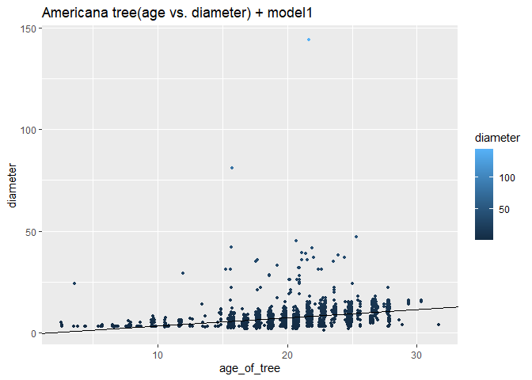

Mini-Data-Analysis 3
================
Yuwei
2021/10/24

# Goal of this project:

-   Manipulating special data types in R: factors and/or dates and
    times.

-   Fitting a model object to your data, and extracting a result.

-   Reading and writing data as separate files.

# Setup

Please install the following four packages before running the code. The
package datateachr contains 7 datasets and I will use vancouver\_trees
dataset for this analysis. The package tidyverse contains the package
dplyr, forcats and tidyr, and I will use it to do data wrangling and
tidy data. The package ggplot2 is used to do visualization in this
analysis. The package lubridate provides tools to parse and manipulate
dates.

``` r
library(datateachr) #contain the dataset we will be using
library(tidyverse) 
library(ggplot2)
library(lubridate)
```

For this Mini Data Analysis 3, I will be using the vancouver\_trees
dataset. This analysis contains three exercises: 1. Special Data types
2. Modeling 3. Reading and writing data

# Research questions:

1.  **What’s the relationship of diameter with respect to the age of the
    tree for AMERICANO species.**

2.  **How many trees were planted every year in Kerrisdale
    neighbourhood? How about every season? Every month?**

# Exercise 1: Special Data Types

In this exercise, I will modify the plot I made in milestone 3. The code
and the plot are placed below:

### Plot from milestone 2:

I divided the age of the trees into 5 groups( 0 to 6, 6 to 11, 11 to 16,
16 to 21, 21 to 26, and 26 +), and use filter to select neighbourhood
that has more than 4000 trees because there are a lot of neighbourhoods
and it is hard to plot all of them. I am going to plot the boxplot and
jitterplot of the diameter for each age group in each neighbourhood.

``` r
vancouver_trees %>%
  select(neighbourhood_name, date_planted, diameter) %>%
  drop_na() %>% # drop all the rows that contain NULL
  mutate(age_of_tree = 2021 - year(date_planted)) %>%
  #add the column of age of the tree
  mutate(age_range = case_when(age_of_tree<6 ~ "0 to 6",
                               age_of_tree<11 ~ "6 to 11",
                               age_of_tree<16 ~ "11 to 16",
                               age_of_tree<21 ~ "16 to 21",
                               age_of_tree<26 ~ "21 to 26",
                               TRUE ~ "26+")) %>%
  #assign the tree into each age group
  group_by(neighbourhood_name) %>%
  filter(n() > 4000 ) %>%
  # Filter the neighbourhood that have more than 2000 trees
  ggplot(aes(x=age_range,y= diameter))+
  geom_jitter(size=0.7, colour = "pink") +
  geom_boxplot(aes(alpha = 0.3)) +
  facet_grid(~neighbourhood_name) +  
  coord_cartesian(ylim =  c(0, 25))+
  theme(axis.text.x = element_text(angle = 45, vjust = 1, hjust = 1))
```

<!-- -->

**Now, we have the plot from previous milestone. I am going to choose
two tasks from the below three tasks and modify this plot by the
instructions.**

1.  Produce a new plot that reorders a factor in your original plot,
    using the `forcats` package (3 points). Then, in a sentence or two,
    briefly explain why you chose this ordering (1 point here for
    demonstrating understanding of the reordering, and 1 point for
    demonstrating some justification for the reordering, which could be
    subtle or speculative.)

2.  Produce a new plot that groups some factor levels together into an
    “other” category (or something similar), using the `forcats` package
    (3 points). Then, in a sentence or two, briefly explain why you
    chose this grouping (1 point here for demonstrating understanding of
    the grouping, and 1 point for demonstrating some justification for
    the grouping, which could be subtle or speculative.)

3.  If your data has some sort of time-based column like a date (but
    something more granular than just a year):

    1.  Make a new column that uses a function from the `lubridate` or
        `tsibble` package to modify your original time-based column. (3
        points)
        -   Note that you might first have to *make* a time-based column
            using a function like `ymd()`, but this doesn’t count.
        -   Examples of something you might do here: extract the day of
            the year from a date, or extract the weekday, or let 24
            hours elapse on your dates.
    2.  Then, in a sentence or two, explain how your new column might be
        useful in exploring a research question. (1 point for
        demonstrating understanding of the function you used, and 1
        point for your justification, which could be subtle or
        speculative).
        -   For example, you could say something like “Investigating the
            day of the week might be insightful because penguins don’t
            work on weekends, and so may respond differently”. But
            first, tasks 1 and 2 below ask you to modify a plot you made
            in a previous milestone. The plot you choose should involve
            plotting across at least three groups (whether by facetting,
            or using an aesthetic like colour). Place this plot below
            (you’re allowed to modify the plot if you’d like). If you
            don’t have such a plot, you’ll need to make one. Place the
            code for your plot below.

**Task Number**: 3

In the previous analysis, I calculated the age of the tree using the
current year subtracting the plant year. But I ignored the time
difference between the plant month and date. So the age I calculated was
not very accurate. I want to add this difference to make the age more
accurate.

Instead of using the previous way to calculate the age of the trees, I
will calculate the time difference between the plant date and the last
date that this dataset was last updated “2021-10-04”(round to 2 decimal
places) by using the lubridate package. First, I am going to add a
column named time\_diff which is the time difference in days. Then I am
going to add a new column called age\_of\_tree which is the time
difference converted in years.

Then, the trees are divided 5 age groups( 0 to 6, 6 to 11, 11 to 16, 16
to 21, 21 to 26, and 26 +) by using the age of the trees we just
calculated. This new tibble is named tree\_age\_range and I am going to
use this tibble to find the distribution of trees by different age
groups.

``` r
tree_age_range <- vancouver_trees %>%
  select(neighbourhood_name, date_planted, diameter) %>%
  drop_na() %>% # drop all the rows that contain NULL
  mutate(time_diff = ymd(20211004)-date_planted) %>%
  #add the column of time difference in day
  mutate(age_of_tree = as.numeric(round(time_diff/365, digits=2))) %>%
  mutate(age_range = case_when(age_of_tree<=6 ~ "0 to 6",
                               age_of_tree<=11 ~ "6 to 11",
                               age_of_tree<=16 ~ "11 to 16",
                               age_of_tree<=21 ~ "16 to 21",
                               age_of_tree<=26 ~ "21 to 26",
                               TRUE ~ "26+"))
  
print(tree_age_range)
```

    ## # A tibble: 70,063 x 6
    ##    neighbourhood_name       date_planted diameter time_diff age_of_tree age_range
    ##    <chr>                    <date>          <dbl> <drtn>          <dbl> <chr>    
    ##  1 MARPOLE                  1999-01-13      10     8300 da~        22.7 21 to 26 
    ##  2 MARPOLE                  1996-05-31      10     9257 da~        25.4 21 to 26 
    ##  3 KENSINGTON-CEDAR COTTAGE 1993-11-22       4    10178 da~        27.9 26+      
    ##  4 KENSINGTON-CEDAR COTTAGE 1996-04-29      18     9289 da~        25.4 21 to 26 
    ##  5 KENSINGTON-CEDAR COTTAGE 1993-12-17       9    10153 da~        27.8 26+      
    ##  6 KENSINGTON-CEDAR COTTAGE 1993-12-16      15    10154 da~        27.8 26+      
    ##  7 KENSINGTON-CEDAR COTTAGE 1993-12-16      14    10154 da~        27.8 26+      
    ##  8 KENSINGTON-CEDAR COTTAGE 1993-12-16      16    10154 da~        27.8 26+      
    ##  9 KENSINGTON-CEDAR COTTAGE 1993-12-03       7.5  10167 da~        27.8 26+      
    ## 10 KENSINGTON-CEDAR COTTAGE 1993-12-03       7.75 10167 da~        27.8 26+      
    ## # ... with 70,053 more rows

**Task Number**: 1

In the original plot, the x-axis age\_range is out of order. So I am
going to use fct\_relevel() to reorder the x-axis.

The graph below is the updated graph after reordering x-axis. After
relevel, we can see the graph makes more sense now. The graphs show that
most trees are between ages 21-26.

``` r
tree_age_range %>%
  group_by(neighbourhood_name) %>%
  filter(n() > 4000 ) %>%
  # Filter the neighbourhood that have more than 2000 trees
  mutate(age_range = fct_relevel(age_range, c("0 to 6","6 to 11", "11 to 16","16 to 21", "21 to 26", "26+"))) %>%
  ggplot(aes(x=age_range,y= diameter))+
  geom_jitter(size=0.7, colour = "pink") +
  geom_boxplot(aes(alpha = 0.3)) +
  facet_grid(~neighbourhood_name) +  
  coord_cartesian(ylim =  c(0, 25))+
  theme(axis.text.x = element_text(angle = 45, vjust = 1, hjust = 1))+
  xlab("age range of tree") + ylab("number of trees")
```

<!-- -->

# Exercise 2: Modelling

## 2.0 Choose research question and variable of interest

The following is the research question and variable of interest I am
going to analyze in this exercise:

**Research Question**: What’s relationship of diameter with respect to
age of the tree for AMERICANO species.

**Variable of interest**: diameter

## 2.1 Model fitting

I am going to make a tibble named Americana\_tree which contains the
diameter and date\_planted for AMERICANA species. Then I am going to add
a new column called age\_of\_tree. Next, I am going to fit a linear
model on diameter with respect to the age of tree and store the model as
model1.

``` r
Americana_tree <- vancouver_trees %>%
  select(species_name,  diameter, date_planted) %>%
  filter(species_name == "AMERICANA" ) %>%
  drop_na()%>%
  mutate(age_of_tree = round(as.numeric((ymd(20211004) - ymd(date_planted))/365),digits=2))

model1 <- lm(diameter~age_of_tree, data = Americana_tree)

print(model1)
```

    ## 
    ## Call:
    ## lm(formula = diameter ~ age_of_tree, data = Americana_tree)
    ## 
    ## Coefficients:
    ## (Intercept)  age_of_tree  
    ##     -0.7912       0.4027

To see the accuracy of model1, I am going to plot the data as points and
model1 as a regression line. There are some extreme outliers that affect
the accuracy of our model. So next, I am going to remove the outliers.

``` r
Americana_tree %>%
  ggplot(aes(age_of_tree, diameter)) +
  geom_point(aes(colour=diameter),size=1) +
  geom_abline(slope=0.4027,intercept=-0.7912)+
  labs(title="Americana tree(age vs. diameter) + model1")
```

<!-- -->

Removing outliers, I am going to store all the outliers in the variable
called outliers. And then I am going to remove these outliers from the
Americana\_tree data and name the new tibble as Americana\_tree\_2.
Next, I am going to fit a new linear model using the new dataset without
outliers.

``` r
outliers <- boxplot(Americana_tree$diameter, plot=FALSE)$out
Americana_tree_2 <- Americana_tree[-which(Americana_tree$diameter %in% outliers),]
#get rid of outliers
model2 <- lm(diameter~age_of_tree, data = Americana_tree_2)
print(model2)
```

    ## 
    ## Call:
    ## lm(formula = diameter ~ age_of_tree, data = Americana_tree_2)
    ## 
    ## Coefficients:
    ## (Intercept)  age_of_tree  
    ##     -0.8627       0.3765

Below is the graph of the data and model2:

``` r
Americana_tree_2 %>%
  ggplot(aes(age_of_tree, diameter)) +
  geom_point(aes(colour=diameter), size=1) +
  geom_abline(slope=0.3765,intercept=--0.8627)+
  labs(title="Amricana tree(age vs. diameter) + model2")
```

<!-- -->

To test if the accuracy of the model was increased by removing outliers,
I summarized the two models. And it is clear that R squared is increased
more than double, so I think the model was improved a lot by removing
outliers.

``` r
summary(model1)
```

    ## 
    ## Call:
    ## lm(formula = diameter ~ age_of_tree, data = Americana_tree)
    ## 
    ## Residuals:
    ##     Min      1Q  Median      3Q     Max 
    ##  -7.974  -2.733  -0.481   1.529 136.061 
    ## 
    ## Coefficients:
    ##             Estimate Std. Error t value Pr(>|t|)    
    ## (Intercept)  -0.7912     0.3899  -2.029   0.0425 *  
    ## age_of_tree   0.4027     0.0201  20.040   <2e-16 ***
    ## ---
    ## Signif. codes:  0 '***' 0.001 '**' 0.01 '*' 0.05 '.' 0.1 ' ' 1
    ## 
    ## Residual standard error: 5.466 on 2286 degrees of freedom
    ## Multiple R-squared:  0.1494, Adjusted R-squared:  0.1491 
    ## F-statistic: 401.6 on 1 and 2286 DF,  p-value: < 2.2e-16

``` r
summary(model2)
```

    ## 
    ## Call:
    ## lm(formula = diameter ~ age_of_tree, data = Americana_tree_2)
    ## 
    ## Residuals:
    ##    Min     1Q Median     3Q    Max 
    ## -7.073 -2.250 -0.096  1.762 10.985 
    ## 
    ## Coefficients:
    ##             Estimate Std. Error t value Pr(>|t|)    
    ## (Intercept) -0.86266    0.20407  -4.227 2.46e-05 ***
    ## age_of_tree  0.37651    0.01053  35.739  < 2e-16 ***
    ## ---
    ## Signif. codes:  0 '***' 0.001 '**' 0.01 '*' 0.05 '.' 0.1 ' ' 1
    ## 
    ## Residual standard error: 2.847 on 2236 degrees of freedom
    ## Multiple R-squared:  0.3636, Adjusted R-squared:  0.3633 
    ## F-statistic:  1277 on 1 and 2236 DF,  p-value: < 2.2e-16

## 2.2 Create tibble with preictions and residual

I am going to produce a new tibble named model2\_fit which includes the
predictions on diameter and the residual using the model2 I fitted
previously using broom::augment().

``` r
model2_fit<- broom::augment(model2) %>% 
  rename(prediction_of_diameter = .fitted, residule = .resid) %>%
  select(diameter, age_of_tree, prediction_of_diameter, residule)

print(model2_fit)
```

    ## # A tibble: 2,238 x 4
    ##    diameter age_of_tree prediction_of_diameter residule
    ##       <dbl>       <dbl>                  <dbl>    <dbl>
    ##  1    10           22.7                   7.70    2.30 
    ##  2     7.5         27.8                   9.62   -2.12 
    ##  3    14.5         21.7                   7.32    7.18 
    ##  4    12           26.6                   9.13    2.87 
    ##  5    13           27.4                   9.47    3.53 
    ##  6     9           25.7                   8.80    0.198
    ##  7     3.25        25.7                   8.80   -5.55 
    ##  8     7           26.9                   9.28   -2.28 
    ##  9     7           26.9                   9.28   -2.28 
    ## 10     7           26.9                   9.28   -2.28 
    ## # ... with 2,228 more rows

# Exercise 3: Reading and writing data

For this exercise, I am going to create a new folder called ‘output’ in
the top level of the repository.

## 3.1 Store tibble as csv file in ‘output’ file

To fulfill the robustness and reprehensibility, I use ifelse to check
weather the ‘output’ folder exists. If it exists, it will return the
current directory of ‘output’ file. If not, it will create a new
‘output’ file in the default location.

Then I am using the tibble named tree\_diameter I created in the
previous milestone. This tibble contains the
mean/minimum/maximum/median/standard deviation and number of trees for
each species.

The last step is to store the data as a csv file and put it in the
‘output’ file using write.csv().

``` r
#create output folder if there is no one. if there is output folder, return the directory
ifelse(!dir.exists(here::here("output")), dir.create(here::here("output")),here::here("output"))
```

    ## [1] "C:/Users/Yuwei/Desktop/Mini-Data-Analysis---Yuwei/output"

``` r
tree_diameter <- vancouver_trees %>%
  select(diameter, species_name) %>%
  group_by(species_name) %>%
  summarise(diameter_mean=mean(diameter, na.rm=TRUE), diameter_min=min(diameter, na.rm=TRUE),
            diameter_max=max(diameter, na.rm=TRUE), diameter_median=median(diameter, na.rm=TRUE),
            diameter_sd=sd(diameter, na.rm=TRUE), number_of_trees=n())

write.csv(tree_diameter, here::here("output", "tree_diameter_data"))
#read.csv(here::here("output", "tree_diameter_data"))
```

## 3.2 Store model2 as RDS file in ‘output’ file

I am going to create a RDS file named ‘model of diameter and age of
tree’ to store the model2 and put it in the ‘output’ folder use
saveRDS() and readRDS().

``` r
ifelse(!dir.exists(here::here("output")), dir.create(here::here("output")),here::here("output"))
```

    ## [1] "C:/Users/Yuwei/Desktop/Mini-Data-Analysis---Yuwei/output"

``` r
saveRDS(model2, file = here::here("output", "model of diameter and age of tree")) 
readRDS(here::here("output", "model of diameter and age of tree"))
```

    ## 
    ## Call:
    ## lm(formula = diameter ~ age_of_tree, data = Americana_tree_2)
    ## 
    ## Coefficients:
    ## (Intercept)  age_of_tree  
    ##     -0.8627       0.3765
